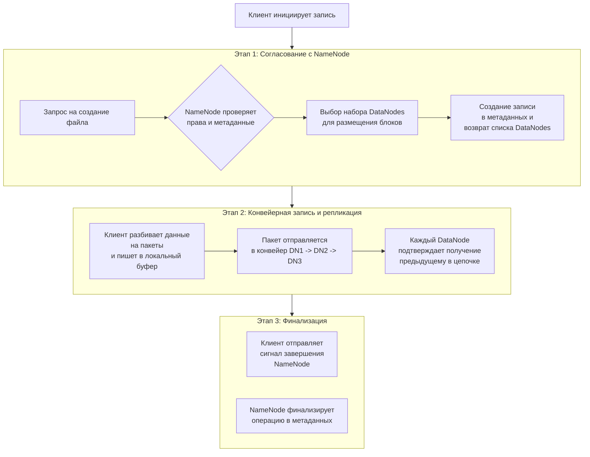
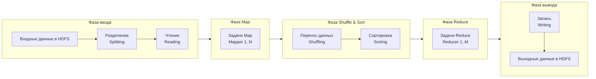

Вот основные понятия экосистемы Apache Hadoop, сгруппированные по ключевым компонентам.

### 1. Apache Hadoop (Ядро)
Это распределённая система для хранения и обработки больших данных на кластерах стандартного оборудования.

*   **Кластер (Cluster)**: Группа связанных компьютеров (нод), работающих вместе.
*   **Master-нода / Slave-нода (Master/Slave)**: Мастер-ноды управляют и координируют работу подчинённых (Slave) нод, на которых хранятся данные и выполняются вычисления.
*   **Rack Awareness**: Стратегия размещения данных и задач с учётом топологии стоек в дата-центре для повышения отказоустойчивости и сетевой эффективности.
*   **Hadoop Common (Hadoop Core)**: Набор общих библиотек и утилит, используемых другими модулями.

### 2. HDFS (Hadoop Distributed File System)
Распределённая файловая система, предназначенная для хранения огромных файлов.

*   **NameNode (NN)**: Главный сервер, который управляет **метаданными** файловой системы (структура каталогов, информация о файлах и их блоках). Он **не хранит сами данные**. В HA-режиме работает в паре **Active/Standby**.
*   **DataNode (DN)**: Slave-ноды, которые непосредственно хранят **блоки данных (Data Blocks)** и обслуживают запросы на чтение/запись.
*   **Блок (Block)**: Базовая единица хранения данных в HDFS (по умолчанию 128 МБ или 256 МБ). Большие файлы разбиваются на блоки, которые распределяются по кластеру.
*   **Репликация (Replication)**: Процесс создания копий (по умолчанию 3) каждого блока на разных DataNode для обеспечения отказоустойчивости.
*   **Secondary NameNode**: Устаревший компонент (не standby!). Выполнял периодические проверки (checkpoint) журналов NameNode. В современных версиях заменён на **Standby NameNode** в конфигурации High Availability (HA).
*   **JournalNode**: Небольшой пул серверов для управления общими журналами (edit logs) в конфигурации HA для NameNode.

### 3. YARN (Yet Another Resource Negotiator)
Фреймворк для управления ресурсами кластера и планирования задач.

*   **ResourceManager (RM)**: Главный демон, который управляет глобальными ресурсами кластера (CPU, память) и планирует выполнение приложений. В HA-режиме также работает как **Active/Standby**.

*   **NodeManager (NM)**: Агент на каждой slave-ноде, который управляет локальными ресурсами и **контейнерами (Containers)**, в которых запускаются задачи.
*   **Контейнер (Container)**: Абстракция, объединяющая выделенные ресурсы (память, CPU) на определённой ноде. В контейнере выполняется процесс задачи.
*   **ApplicationMaster (AM)**: Специфичный для каждого приложения (например, MapReduce, Spark) процесс, который **договаривается** с ResourceManager о ресурсах и **управляет** выполнением задач через NodeManager.
*   **Очередь (Queue)**: Основная единица организации в **Capacity Scheduler** или **Fair Scheduler**. Ресурсы кластера распределяются между очередями, которые могут принадлежать разным отделам или проектам.

### 4. MapReduce (Устаревшая, но концептуально важная модель)
Программная модель для параллельной обработки больших наборов данных.

*   **Job (Задание)**: Полная единица работы, которую пользователь хочет выполнить (например, подсчёт слов). Состоит из **входных данных, кода MapReduce и конфигурации**.
*   **Task (Задача)**: Экземпляр выполнения кода Map или Reduce на **одном фрагменте данных**. Job разбивается на множество задач.
*   **Mapper**: Функция, которая обрабатывает входные пары ключ-значение и генерирует набор промежуточных пар ключ-значение. Работает на этапе **Map**.
*   **Reducer**: Функция, которая получает все промежуточные значения, ассоциированные с одним ключом, и обрабатывает их для формирования окончательного результата. Работает на этапе **Reduce**.
*   **Shuffle & Sort (Перемешивание и сортировка)**: Фаза между Map и Reduce, когда данные с выходов всех Mapper группируются по ключу и сортируются перед отправкой Reducer'ам.

### Сводная таблица архитектуры

| Роль | Компонент HDFS | Компонент YARN | Основная функция |
| :--- | :--- | :--- | :--- |
| **Главный (Master)** | NameNode (Active/Standby) | ResourceManager (Active/Standby) | Управление метаданными (HDFS) или глобальными ресурсами (YARN). |
| **Рабочий (Slave)** | DataNode | NodeManager | Хранение данных (HDFS) или управление локальными ресурсами и контейнерами (YARN). |
| **Специальный процесс** | JournalNode (для HA) | ApplicationMaster (на per-job основе) | Синхронизация состояний (HDFS) или управление жизненным циклом конкретного приложения (YARN). |

### Кратко о месте MapReduce сегодня
Важно понимать, что **MapReduce — это лишь один из видов приложений**, которые могут работать поверх YARN. Современные фреймворки, такие как **Apache Spark** или **Apache Tez**, выполняются на YARN гораздо эффективнее и в большинстве случаев заменили MapReduce для задач ETL и анализа данных.

Вот основные инструменты экосистемы больших данных, сгруппированные по их назначению.

### 📊 Сводная таблица
Для быстрого сравнения:

| Инструмент | Основная категория | Краткое назначение | Ключевая особенность |
| :--- | :--- | :--- | :--- |
| **Apache Hive** | Движок запросов | **SQL-интерфейс** для обработки больших данных в HDFS. | Преобразует SQL-запросы (HiveQL) в задания MapReduce/Tez/Spark. |
| **Apache Spark** | Фреймворк обработки | **Универсальный и быстрый движок** для обработки данных в памяти. | Скорость, удобные API (Scala/Py/Java/R), поддержка SQL, стриминга, ML. |
| **Apache HBase** | База данных | **Распределенная NoSQL БД** для быстрого чтения/записи больших таблиц. | Хранит данные в виде `ключ-значение/колоночно`, работает поверх HDFS. |
| **Apache Phoenix** | SQL-слой | **SQL-драйвер и движок запросов** поверх HBase. | Преобразует стандартный SQL и JDBC-запросы в нативные вызовы HBase. |
| **Apache Oozie** | Оркестратор | **Сервер рабочих процессов** для координации заданий Hadoop. | Описывает пайплайны в XML, тесно интегрирован с Hadoop (YARN, HDFS). |
| **Apache Airflow** | Оркестратор | **Платформа для создания, планирования и мониторинга** пайплайнов. | Пайплайны как код на Python, богатый UI, обширная экосистема коннекторов. |

### 🔧 Более подробное описание

**Apache Hive**
*   **Что это**: Система управления данными на основе SQL (HiveQL) для Hadoop.
*   **Аналогия**: Похож на "переводчика", который превращает ваш знакомый SQL-запрос в серию сложных распределенных заданий (MapReduce, Tez, Spark), которые могут выполняться в кластере.
*   **Для чего**: Для выполнения ETL (Extract, Transform, Load), аналитической отчетности и ad-hoc-анализа больших наборов структурированных и полуструктурированных данных, хранящихся в HDFS или облачных хранилищах.

**Apache Spark**
*   **Что это**: Универсальный, высокопроизводительный фреймворк для распределенной обработки данных, который может работать как в режиме кластера YARN, так и самостоятельно.
*   **Аналогия**: Мощный "двигатель" нового поколения, который вместо постоянной записи на диск (как MapReduce) по максимуму использует оперативную память для ускорения вычислений.
*   **Для чего**: Для сложной аналитики, машинного обучения (MLlib), обработки графов (GraphX), потоковой обработки в реальном времени (Structured Streaming) и, конечно, для пакетной обработки, где он часто заменяет MapReduce.

**Apache HBase**
*   **Что это**: Распределенная, масштабируемая, NoSQL база данных, работающая поверх HDFS.
*   **Аналогия**: Огромная "таблица", похожая на Google Bigtable, которая может хранить миллиарды строк и миллионы колонок, обеспечивая при этом быстрый произвольный доступ к данным по ключу.
*   **Для чего**: Для сценариев, требующих низкоуровневого произвольного доступа на чтение и запись в реальном времени (например, ленты сообщений, данные с датчиков, результаты онлайн-транзакций).

**Apache Phoenix**
*   **Что это**: Слой поверх HBase, который добавляет поддержку SQL-запросов и интерфейс JDBC.
*   **Аналогия**: "Удобная оболочка" для HBase, которая позволяет взаимодействовать с ней, используя знакомый SQL, вместо того чтобы писать сложный Java-код для API HBase.
*   **Для чего**: Для выполнения сложных запросов, агрегаций и соединений (joins) к данным в HBase с помощью стандартного SQL, а также для легкой интеграции с BI-инструментами через JDBC.

**Apache Oozie**
*   **Что это**: Сервер рабочих процессов и координатор для управления заданиями Hadoop.
*   **Аналогия**: "Дирижер оркестра", который по заранее написанному сценарию (партитуре) запускает в нужной последовательности задания MapReduce, Hive, Pig, Sqoop и другие.
*   **Для чего**: Для создания сложных, многозадачных пайплайнов данных с зависимостями, расписанием и условиями.

**Apache Airflow**
*   **Что это**: Платформа для программируемого оркестрирования, планирования и мониторинга рабочих процессов.
*   **Аналогия**: Более современный и гибкий "менеджер проектов", который позволяет описывать сложные пайплайны задач (DAG) в виде кода на Python.
*   **Для чего**: Для оркестрации практически любых задач (не только Hadoop), включая запуск скриптов, SQL-запросов, задач в облачных сервисах. Широко используется из-за гибкости, мощного UI и активного сообщества.

### 💡 Как они работают вместе?
Типичный пайплайн может выглядеть так:
1.  **Oozie** или **Airflow** запускает процесс по расписанию.
2.  Инструмент для переноса данных (например, Apache Sqoop) загружает данные из реляционной СУБД в **HDFS**.
3.  Запускается **Spark** или **Hive** для очистки и преобразования этих данных.
4.  Результаты записываются в аналитическую таблицу в **HBase** для быстрого доступа.
5.  Через **Phoenix** к этим данным подключаются BI-инструменты для построения отчетов.
6.  Весь этот процесс координируется и отслеживается через **Airflow**.

**Apache ZooKeeper** — это централизованный сервис для координации работы распределённых систем, таких как Hadoop, Kafka или HBase. Он предназначен не для хранения данных пользователя, а для управления метаданными, конфигурацией и состоянием кластера.

###  Для чего используется ZooKeeper
В распределённых системах, где множество серверов работают вместе, критически важно обеспечить их согласованность. ZooKeeper решает ряд базовых, но сложных в реализации задач:

*   **Координация и выбор лидера (Leader Election)**: Автоматически назначает «главный» узел среди группы серверов и обеспечивает быстрый переход этой роли при сбоях.
*   **Управление конфигурацией**: Хранит настройки для всех узлов кластера в одном месте, обеспечивая их единообразие и возможность обновления «на лету».
*   **Обнаружение сбоев и состояние узлов**: Узлы регистрируются в ZooKeeper. Если узел отключается (например, из-за сбоя), его запись автоматически удаляется, и остальная система мгновенно узнаёт об этом.
*   **Распределённые блокировки и синхронизация**: Обеспечивает безопасный доступ к общим ресурсам, предотвращая конфликты между узлами.

###  Как устроен ZooKeeper
*   **Архитектура кластера (Ансамбль)**: ZooKeeper сам является распределённой системой, работающей на нечётном количестве серверов (обычно 3 или 5). Это обеспечивает отказоустойчивость.
    *   **Лидер (Leader)**: Один сервер обрабатывает все операции записи.
    *   **Последователи (Followers)**: Остальные серверы реплицируют данные и обслуживают запросы на чтение, что обеспечивает высокую производительность.
*   **Модель данных (ZNodes)**: Данные хранятся в виде иерархического дерева узлов (**ZNodes**), похожего на файловую систему.
    *   **Эфемерные узлы (Ephemeral)**: Существуют только во время активности подключённого клиента и автоматически удаляются при его отключении. Это основа для обнаружения сбоев.
    *   **Наблюдатели (Watchers)**: Клиенты могут «подписаться» на узел и получать мгновенные уведомления при его изменении, что позволяет эффективно реагировать на события в системе.
*   **Гарантии**: ZooKeeper обеспечивает строгую консистентность данных, порядок операций и надёжность, что делает его предсказуемой основой для построения сложных систем.

### 🔧 Примеры использования в экосистеме больших данных
Вот как конкретные технологии применяют ZooKeeper для своих задач:

| Проект / Технология | Основная роль ZooKeeper |
| :--- | :--- |
| **Apache Kafka** | Хранит метаданные о брокерах, топиках, управляет выбором лидера для разделов (партиций). |
| **Apache HBase** | Координирует работу Master-сервера, отслеживает состояние Region Servers, хранит адреса корневых регионов. |
| **Apache Hadoop (HDFS, YARN)** | Обеспечивает высокую доступность (HA) для NameNode и ResourceManager, управляя выбором активного лидера. |
| **Apache Solr Cloud** | Используется для централизованного хранения конфигурации коллекций и обнаружения узлов кластера. |

### ⚠️ Важные ограничения и альтернативы
1.  **Не для хранения больших данных**: ZNode предназначен для хранения конфигураций и состояния (объёмом до нескольких мегабайт), а не пользовательских файлов или записей.
2.  **Сложность настройки и эксплуатации**: Требует глубокого понимания распределённых систем для корректной настройки таймаутов и обеспечения стабильности.
3.  **Узкая специализация**: Это низкоуровневая система координации. Для упрощения разработки поверх неё часто используют фреймворки вроде **Apache Curator**, предоставляющие готовые рецепты для распределённых задач.
4.  **Альтернативы**: В некоторых сценариях используют **etcd** или **Consul**, которые также предоставляют возможности координации и обнаружения сервисов.

Чтобы понять связь лучше: если бы распределённый кластер был оркестром, то **ZooKeeper — это дирижёр и партитура в одном лице**, который задаёт темп, следит за вступлением музыкантов (узлов) и оперативно находит замену, если кто-то выбыл.

Запись данных в HDFS — это не просто сохранение файла на диск, а многоступенчатый распределённый процесс, ориентированный на надёжность и эффективность в сценариях **однократной записи и многократного чтения (Write-Once, Read-Many)**.

Основные этапы процесса записи показаны на схеме и подробно описаны ниже:

### 🔍 Подробнее об этапах и ролях компонентов

На каждом этапе ключевые компоненты HDFS выполняют строго определённые задачи:

| Этап | Роль NameNode | Роль DataNodes | Роль Клиента |
| :--- | :--- | :--- | :--- |
| **1. Согласование** | Проверяет права, создаёт запись в метаданных, выбирает DataNodes для блока. | — | Инициирует запрос на создание файла. |
| **2. Конвейерная запись** | — | Принимают, хранят и реплицируют пакеты данных по цепочке. | Разбивает данные на пакеты, управляет конвейером, обрабатывает ошибки. |
| **3. Финализация** | Подтверждает успешное завершение, обновляет метаданные. | — | Отправляет сигнал завершения записи. |

### 💡 Ключевые принципы и особенности записи в HDFS

*   **Write-Once модель**: HDFS оптимизирована для сценария, когда файл создаётся, один раз записывается полностью и затем только читается. Изменение содержимого уже записанного файла **невозможно**. Можно лишь дописывать данные в конец (append), и эта операция имеет ряд ограничений.
*   **Гарантия согласованности**: Процесс с конвейерной репликацией и подтверждением гарантирует, что данные либо будут записаны на все реплики корректно, либо операция полностью откатится.
*   **Восстановление при сбоях**: Если DataNode в конвейере выходит из строя во время записи, конвейер автоматически перестраивается, а повреждённые части данных перезаписываются. Это обеспечивает устойчивость к отказам.
*   **Сравнение с локальной ФС**: В отличие от локальной файловой системы, где запись — это прямая операция с диском, в HDFS это сложный сетевой протокол с участием нескольких независимых серверов и центрального координатора (NameNode).

Именно эти принципы делают HDFS надёжным хранилищем для больших данных, но также накладывают ограничения на сценарии её использования.

Kafka и Hadoop — это два мощных, но принципиально разных инструмента для работы с данными. Вместе они образуют основу современных конвейеров данных (data pipeline). Вот как выглядят их базовые отличия:

| Аспект | **Apache Kafka** | **Apache Hadoop** |
| :--- | :--- | :--- |
| **Основное назначение** | **Распределённая потоковая платформа** для обработки данных в реальном времени. | **Фреймворк** для **пакетного хранения (HDFS)** и **обработки (MapReduce/YARN)** больших данных. |
| **Модель работы с данными** | Публикация/подписка (Pub/Sub) на потоки событий (сообщений). | Хранение файлов и их пакетная обработка. |
| **Ключевая метафора** | **Непрерывный и упорядоченный "журнал" (log)** событий, которые можно перечитывать. | **"Файловая система" (HDFS)** и **"фабрика задач" (YARN)** для вычислений. |
| **Временные характеристики** | **Низкая задержка**, обработка в реальном времени. | Высокая пропускная способность, но **задержка выше**, ориентирован на пакетные задачи. |
| **Хранение данных** | Сообщения хранятся ограниченное время (настраивается). | Данные хранятся **постоянно** в распределённом виде с репликацией. |
| **Основные потребители** | Микросервисы, стриминг-приложения (Spark Streaming, Flink), конвейеры данных. | Системы аналитики (Hive, Spark), пакетные ETL-задачи, Data Lake. |

###  Основные концепции и архитектура Kafka
Чтобы понять, как Kafka взаимодействует с Hadoop, нужно знать её базовые компоненты:
1.  **Топик (Topic)** — категория или поток сообщений (например, `user_logins` или `sensor_data`). В отличие от очереди, сообщение в топике **не удаляется после прочтения** и может быть обработано множеством потребителей.
2.  **Партиция (Partition)** — топик делится на партиции для параллелизма. Сообщения внутри партиции хранятся в строгом порядке и получают уникальный **смещённый индекс (offset)**.
3.  **Производитель (Producer)** — приложение, которое публикует (пишет) сообщения в топик.
4.  **Потребитель (Consumer)** — приложение, которое подписывается на топики и читает сообщения. Потребители объединяются в **группы (Consumer Groups)**, где каждый экземпляр читает уникальный набор партиций для распределения нагрузки.
5.  **Брокер (Broker)** — сервер в кластере Kafka, который хранит данные и обслуживает запросы. Кластер состоит из нескольких брокеров для обеспечения отказоустойчивости.
6.  **ZooKeeper** (или KRaft в новых версиях) — служба для управления метаданными кластера, выбора лидера партиции и отслеживания состояния брокеров.

###  Как Kafka взаимодействует с Hadoop: два основных подхода
Интеграция строится на том, что Kafka выступает в роли **высокоскоростного буфера и транспорта** для доставки данных в Hadoop для долгосрочного хранения и углублённого анализа.

1.  **Hadoop как потребитель данных из Kafka (Kafka → HDFS)**
    Это **самый распространённый сценарий**. Данные из топиков Kafka непрерывно загружаются в HDFS для создания "сырого" или "стейджингового" (staging) слоя Data Lake.
    *   **Как работает**: Специальные процессы-консьюмеры (часто реализованные с помощью **Apache NiFi**, **Apache Flume** или **Spark Streaming**) читают потоки из Kafka и записывают их в файлы HDFS.
    *   **Ключевые моменты**:
        *   **Достиранные файлы**: Сообщения из Kafka обычно **накапливаются в буфер** и записываются в HDFS крупными блоками (например, каждые 5 минут или при достижении 128 МБ), чтобы избежать проблемы мелких файлов.
        *   **Структурирование данных**: Часто данные сохраняют в эффективных колоночных форматах (Parquet, ORC) или формате Avro со схемой, что удобно для последующего запроса через Hive или Spark.
        *   **Партиционирование в HDFS**: Файлы часто организуют в директории по дате (`/dwh/dt=2026-01-21/`), что позволяет Hive/Spark эффективно "пропускать" нерелевантные данные при запросах.

2.  **Hadoop как источник данных для Kafka (Hadoop → Kafka)**
    Этот сценарий используется реже, обычно для обратной отправки результатов обработки или обогащённых данных из Hadoop обратно в реальном времени.
    *   **Как работает**: Используются инструменты вроде **Apache Pig** (с `AvroKafkaStorage`) или кастомные **MapReduce/Spark**-задачи, которые выступают в роли продюсеров и публикуют данные в топики Kafka.

### Типичные задачи и проблемы при интеграции
*   **Управление смещённым индексом (Offset Management)** — при загрузке в HDFS необходимо точно отслеживать, какие сообщения уже сохранены, чтобы не потерять данные и не задублировать их. Это часто решается через сохранение метаданных Kafka (topic, partition, offset) вместе с данными в HDFS.
*   **Согласованность схем данных (Schema Evolution)** — структура сообщений в Kafka может меняться. Использование **Schema Registry** и форматов вроде Avro помогает безопасно управлять изменениями схем при записи в Hive-таблицы.
*   **Производительность** — прямое чтение из HBase для соединения с данными Kafka показало себя неэффективным в промышленных условиях из-за отсутствия predicate pushdown, что привело к отказу от этой схемы в пользу выгрузки в HDFS.

### Краткий итог
*   **Kafka** — это **центральная "магистраль" (data highway)** для потоковых событий в реальном времени.
*   **Hadoop (HDFS)** — это **"озеро" (Data Lake)** для долгосрочного, надёжного хранения и пакетной аналитики.
*   **Интеграция** позволяет построить гибридную архитектуру: данные в реальном времени поступают через Kafka, накапливаются в HDFS, где затем обрабатываются мощными пакетными задачами (Spark, Hive) для получения глубокой аналитики и моделей.

**Apache MapReduce** — это не фреймворк, а **программная модель** для параллельной обработки огромных наборов данных на больших кластерах. Её основная идея — разбить сложную задачу на множество мелких, которые можно выполнять независимо и параллельно.

Хотя сам фреймворк Hadoop MapReduce сегодня считается устаревшим и медленным (его заменили Apache Spark, Tez), **концепция Map/Shuffle/Reduce** остаётся фундаментальной для распределённых вычислений.

### Архитектура и основные компоненты
Задание (Job) в MapReduce выполняется под управлением двух ключевых демонов YARN:
*   **ResourceManager (RM)**: Выделяет ресурсы для всего задания.
*   **ApplicationMaster (AM)**: Управляет жизненным циклом конкретного задания MapReduce — запрашивает контейнеры, отслеживает прогресс и обрабатывает сбои.

Непосредственно задачи запускаются в **контейнерах (Containers)** на **NodeManager (NM)**.

### Стадии выполнения задания MapReduce
Процесс состоит из нескольких чётких фаз, которые показаны на схеме ниже:

###  Подробное описание каждой фазы
На каждой стадии выполняются строго определённые операции:

| Фаза | Что происходит | Кто выполняет | Результат |
| :--- | :--- | :--- | :--- |
| **1. Подготовка (Input)** | Файлы в HDFS разбиваются на логические **сплиты (Input Splits)**, обычно равные размеру блока HDFS (128 МБ). | Фреймворк MapReduce | Набор сплитов, каждый из которых будет обработан одной задачей Map. |
| **2. Map** | Для каждого сплита запускается **задача Map (Mapper)**. Mapper читает данные (строку, запись) и применяет пользовательскую функцию `map()`, которая выдаёт промежуточные пары **ключ-значение**. | Задачи Map (запускаются в контейнерах) | Список пар `<k1, v1> -> <k2, v2>`. Например, для текста: `<"hello", 1>`. |
| **3. Shuffle & Sort** | **Shuffle**: Данные с выходов всех Mapper'ов передаются на узлы, где будут запущены задачи Reduce.   **Sort**: На каждом узле Reducer'а все значения **группируются по ключу** и **сортируются**. Это самая сеттемо- и дискоёмкая фаза. | Фреймворк MapReduce (частично — задачи Map и Reduce) | Данные на входе Reducer'а: `<k2, [v2, v2, v2...]>`. |
| **4. Reduce** | Для каждой уникальной группы ключей запускается **задача Reduce**. Reducer применяет пользовательскую функцию `reduce()` ко списку значений и формирует финальные пары ключ-значение. | Задачи Reduce (запускаются в контейнерах) | Финальный результат, например: `<"hello", 155>`. |
| **5. Запись (Output)** | Reducer записывает итоговые пары в файлы вывода в HDFS, обычно по одному файлу на Reducer. | Задачи Reduce | Результирующие файлы в HDFS. |

### 💡 Пример: Подсчёт слов (WordCount)
Классический пример, иллюстрирующий работу модели:
*   **Входные данные**: "hello world hello"
*   **Map**: Каждый Mapper выдаёт пары: `[<"hello",1>, <"world",1>, <"hello",1>]`.
*   **Shuffle & Sort**: Данные группируются по ключу: `[<"hello", [1,1]>, <"world", [1]>]`.
*   **Reduce**: Reducer суммирует значения для каждого ключа: `[<"hello",2>, <"world",1>]`.

### 🏗 Ключевые принципы и почему MapReduce устарел
*   **Локализация данных**: Фреймворк старается запустить задачу Map **на том же узле, где хранятся её данные**, минимизируя сетевой трафик.
*   **Отказоустойчивость**: Если задача Map или Reduce падает, ApplicationMaster перезапускает её на другом узле.
*   **Устаревание**: Основная проблема — **все промежуточные результаты записываются на диск** (в HDFS) после каждой фазы, что крайне медленно. Современные фреймворки вроде **Apache Spark** выполняют вычисления **в оперативной памяти**, что на порядки ускоряет обработку.

###  Краткий итог
MapReduce — это модель "разделяй и властвуй" для данных: **разбей (Map), перемешай и отсортируй (Shuffle & Sort), объедини (Reduce)**. Понимание этих стадий необходимо для работы с любыми распределёнными системами, даже если вы используете более современные инструменты, такие как Spark, который является интеллектуальным наследником этих идей.

Если вы хотите глубже разобраться в отличиях MapReduce от Spark или в том, как именно Shuffle влияет на производительность, я готов рассказать об этом подробнее.

Parquet и ORC — это колоночные форматы, оптимизированные для аналитики, в то время как Avro — это строчный формат, созданный для эффективной сериализации данных. Важно, что вы упомянули "Afro" — возможно, имелся в виду **Avro**, популярный формат в экосистеме Hadoop.

Вот сравнительная таблица, которая показывает ключевые различия:

| Характеристика | Apache Parquet | Apache ORC | Apache Avro |
| :--- | :--- | :--- | :--- |
| **Модель хранения** | Колоночная (columnar) | Колоночная (columnar) | Строчная (row-based) |
| **Основная оптимизация** | Эффективное чтение и сжатие для аналитических запросов | Высокая производительность чтения и сжатие, особенно в Hive | Компактная сериализация и десериализация данных |
| **Схема данных** | Встроена в файл, поддерживает эволюцию схемы | Встроена в файл | Всегда прилагается к данным (в JSON), критична для чтения |
| **Ключевые преимущества** | Широкая поддержка экосистемой (Spark, Hive, Impala), отлично подходит для облачных хранилищ. | Лучшее сжатие и встроенные индексы для ускорения чтения, нативная поддержка ACID-транзакций в Hive. | Быстрая запись/чтение, легкая эволюция схемы, идеален для потоковой передачи (Kafka). |
| **Типичное использование** | Аналитические хранилища данных, ETL-процессы, машинное обучение. | Хранилища данных на основе Hive, аналитические системы в экосистеме Hadoop. | Передача данных, сериализация сообщений, конвейеры реального времени. |

###  Детальное описание форматов

1.  **Apache Parquet**
    Этот формат был создан для максимальной производительности аналитических запросов, которые часто обращаются только к подмножеству столбцов. Данные в Parquet хранятся колонками, а также разделены на группы строк (Row Groups) и страницы (Pages), что позволяет системам вроде Spark или Hive эффективно считывать только нужные блоки данных, минимизируя операции ввода-вывода. Parquet отлично сжимает данные (например, с помощью Snappy или GZIP) и поддерживает сложные вложенные структуры, что делает его стандартом де-факто для современных data lake.

2.  **Apache ORC**
    ORC (Optimized Row Columnar) также является колоночным форматом. Он был создан несколько раньше Parquet и первоначально оптимизирован для работы с Apache Hive. Его ключевая особенность — детальная внутренняя организация данных: файл делится на **страйпы (stripes)**, внутри которых есть индексы (Index Data), сами данные (Row Data) и нижний колонтитул (Stripe Footer). Это позволяет ORC "пропускать" целые блоки нерелевантных данных при поиске, что значительно ускоряет выполнение запросов с условиями (предикатами). Также ORC часто обеспечивает лучшее сжатие, чем Parquet, и имеет нативную поддержку ACID-транзакций при использовании с Hive.

3.  **Apache Avro**
    Avro кардинально отличается. Это строчный формат, предназначенный в первую очередь для **сериализации** данных. Его главная цель — обеспечить компактное и быстрое преобразование данных в байтовый поток и обратно для передачи между системами. Схема данных (в формате JSON) всегда хранится вместе с данными, что делает файлы самоописываемыми и упрощает эволюцию схемы — вы можете добавлять новые поля, сохраняя совместимость со старыми версиями. Благодаря этим свойствам Avro стал одним из стандартных форматов для передачи сообщений в Apache Kafka и для сериализации в конвейерах данных реального времени.

###  Как выбрать формат для своих задач?
Рекомендация строится на типе рабочей нагрузки и используемых инструментах:

*   Выбирайте **Parquet**, если:
    *   Вы строите аналитическое хранилище или data lake.
    *   Ваши рабочие нагрузки — это сложные аналитические запросы (например, в Apache Spark, Hive, Impala).
    *   Вам важна широкая поддержка формата разными облачными сервисами (AWS Athena, Google BigQuery) и фреймворками.

*   Выбирайте **ORC**, если:
    *   Ваша инфраструктура глубоко интегрирована с **Apache Hive**.
    *   Вам критически важна максимальная эффективность сжатия данных и скорость чтения для запросов с фильтрацией.
    *   Требуется поддержка ACID-транзакций на уровне файлового формата (например, для операций UPDATE/DELETE в Hive).

*   Выбирайте **Avro**, если:
    *   Вы разрабатываете **конвейер передачи данных** (например, на основе Kafka).
    *   Вам нужна эффективная сериализация для обмена сообщениями между сервисами.
    *   Ваша схема данных часто меняется, и вам нужен простой механизм управления этими изменениями.
